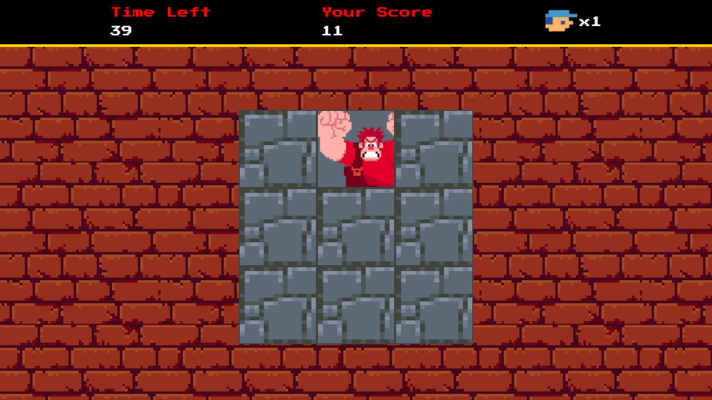

# :video_game: Detona Ralph

Este projeto apresenta um jogo baseado no filme Detona Ralph. Seu objetivo é acertar o Ralph o máximo de vezes em que ele aparecer. Para cada vez que a janela atingida não contém o alvo perde-se uma vida. O jogo acaba quando o tempo se esgota ou não restam mais vidas.

Utilizando JavaScript puro exploram-se conceitos como organização de projeto e de arquivos de código para desenvolvimento de jogos, conceito semântico de variáveis além do uso de eventos e manipulação de áudios. Este é um desafio de projeto da Digital Innovation One.

## :gear: Tecnologias

- HTML
- CSS
- JavaScript

## :art: Layout

